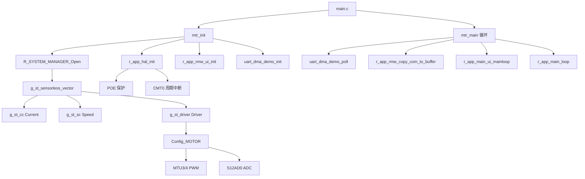
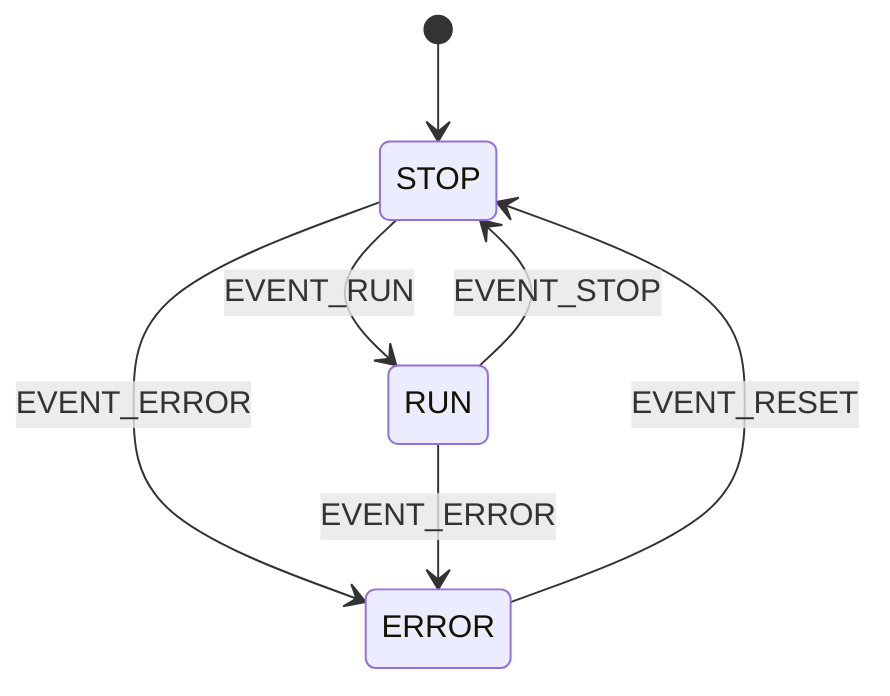
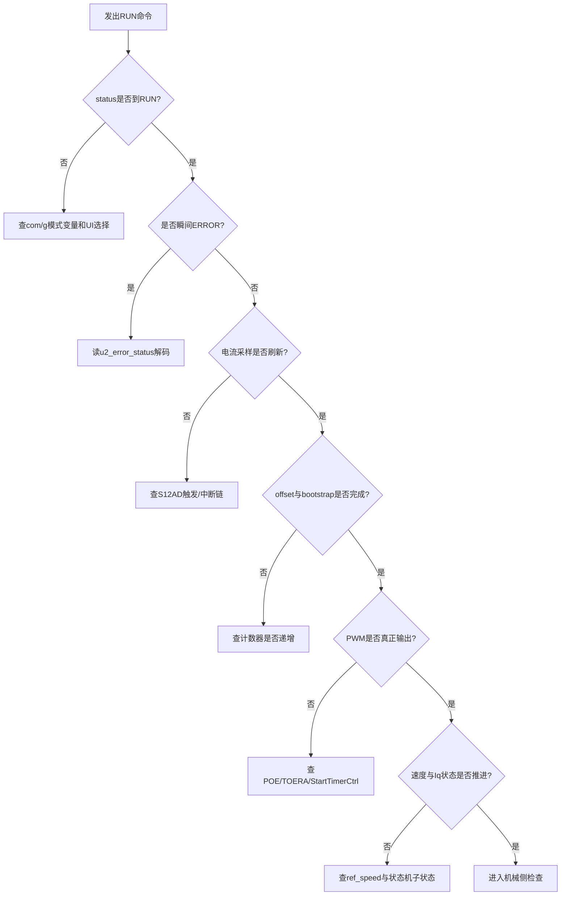

# RX26T 电机控制代码详解与排障手册（中文）

## 1. 文档目的与范围
- 面向当前工程 `RX26TFADFM_UART_DMA_Motor`，说明电机控制主链路的代码结构、关键全局变量、运行流程与排障方法。
- 基线为当前已合并版本：`main` 入口统一在 `src/app/main.c`，电机底层统一为 `MTU3/4 + POE + S12AD0 + CMT0`，UART-DMA 以非阻塞方式并入主循环。
- 本文重点关注电机控制；UART 仅覆盖与电机主循环耦合的部分。

## 2. 代码总览（核心路径）
- 入口与调度：
  - `src/app/main.c`
  - `src/app/main/mtr_main.c`
- 系统管理与算法入口：
  - `src/app/system_module/system_manager/r_system_manager_api.c`
  - `src/app/motor_module/sensorless_vector/r_motor_sensorless_vector_api.c`
- 三大子模块（全局实例）：
  - 电流环：`src/app/motor_module/current/r_motor_current_api.c` -> `g_st_cc`
  - 速度环：`src/app/motor_module/speed/r_motor_speed_api.c` -> `g_st_sc`
  - 驱动桥接：`src/app/motor_module/driver/r_motor_driver.c` -> `g_st_driver`
- 硬件抽象与外设：
  - `src/app/mcu/rx26t/r_app_mcu.c`
  - `src/app/motor_module/Config_MOTOR/Config_MOTOR.c`
  - `src/smc_gen/Config_S12AD0/Config_S12AD0_user.c`
  - `src/smc_gen/Config_CMT0/Config_CMT0_user.c`
  - `src/smc_gen/Config_POE/Config_POE_user.c`
- ICS/UI 参数桥接：
  - `src/app/user_interface/ics/r_mtr_ics.c`
  - `src/app/user_interface/ics/ICS2_RX26T.c`

## 3. 电机软件结构图


### 3.1 分层职责
- 应用层：模式切换、UI/ICS 命令收发、参数更新触发。
- 系统管理层：把命令和参数映射到电机算法 API。
- 算法层（sensorless vector）：状态机、保护、flying start、current/speed 子模块协调。
- 驱动层：把浮点占空比和 ADC 实际值转换为硬件计数/物理量。
- 外设层：MTU3/4 产生 PWM，S12AD0 采样，POE 保护切断，CMT0 提供速度环节拍。

## 4. 主流程图
```mermaid
flowchart TD
    A[上电 main] --> B[mtr_init]
    B --> B1[uart_dma_demo_init]
    B --> B2[r_app_rmw_hw_init]
    B --> B3[R_SYSTEM_MANAGER_Open]
    B --> B4[r_app_hal_init]
    B --> B5[r_app_rmw_ui_init]
    B --> C[while(1) mtr_main]
    C --> C1[uart_dma_demo_poll]
    C --> C2[r_app_rmw_copy_com_to_buffer]
    C --> C3[UI主循环: ICS/Board]
    C --> C4[r_app_main_loop]
    C --> C
```

## 5. 中断链路与节拍

### 5.1 中断源与职责
| 中断源 | 文件入口 | 触发职责 | 典型周期 |
|---|---|---|---|
| S12AD0 S12ADI | `Config_S12AD0_user.c` | `mtr_interrupt_current_cyclic()`，执行电流环主循环与 ICS 中断处理 | 约 50us（20kHz） |
| CMT0 CMI0 | `Config_CMT0_user.c` | `mtr_interrupt_speed_cyclic()`，执行速度环与硬件毫秒计数 | 500us（2kHz） |
| POE OEI1 | `Config_POE_user.c` | 先置 Hi-Z，再 `mtr_interrupt_hw_overcurrent()` 上报硬过流错误 | 异步事件 |

### 5.2 电流中断内部流程（核心）
```mermaid
flowchart TD
    A[S12AD0中断] --> B[读取 iu/iw/vdc]
    B --> C[去电流偏置]
    C --> D[计算 iv = -(iu+iw)]
    D --> E[保护检查 overcurrent/voltage/speed/stall]
    E --> F{状态是否 RUN}
    F -- 否 --> Z[退出]
    F -- 是 --> G{offset 完成?}
    G -- 否 --> G1[50%占空比 + OffsetCalibration]
    G1 --> Z
    G -- 是 --> H{bootstrap 完成?}
    H -- 否 --> H1[50%占空比 + ChargeBootstrap]
    H1 --> Z
    H -- 是 --> I{flying start 启用?}
    I -- 否 --> J[CurrentCyclic + 更新PWM]
    I -- 是 --> K[执行 flying start 状态机]
    K --> J
    J --> Z
```

### 5.3 速度中断内部流程
- 仅在 `STATEMACHINE_STATE_RUN` 且速度模块 active 时推进。
- 关键动作：
  - 更新相位误差 LPF。
  - 按 `u2_run_mode`（`INIT/BOOT/DRIVE`）执行速度环。
  - 推进 `speed/id/iq` 三个参考状态机。
  - 更新硬件毫秒计数 `mtr_interrupt_hw_time_ms_get()`（被 UART autosweep 使用，属于硬件定时基准）。

## 6. 状态机与运行阶段

### 6.1 顶层状态机（`st_stm.u1_status`）
- `0`: `STATEMACHINE_STATE_STOP`
- `1`: `STATEMACHINE_STATE_RUN`
- `2`: `STATEMACHINE_STATE_ERROR`



### 6.2 RUN 内部阶段（`u2_run_mode`）
- `0`: `MOTOR_MODE_INIT`
- `1`: `MOTOR_MODE_BOOT`
- `2`: `MOTOR_MODE_DRIVE`

### 6.3 参考值子状态（关键观察）
- `u1_state_id_ref`：`ZERO -> UP -> MANUAL -> DOWN -> INPUT`
- `u1_state_iq_ref`：`ZERO -> AUTO_ADJ/PI_OUTPUT -> DOWN`
- `u1_state_speed_ref`：`ZERO -> MANUAL`

## 7. 关键全局变量说明

## 7.1 上层命令与模式变量
| 变量 | 位置 | 作用 | 常见期望 |
|---|---|---|---|
| `com_u1_system_mode` | `r_mtr_ics.c` | 通信写入的模式命令 | 启动时写 `1` |
| `g_u1_system_mode` | `r_mtr_ics.c` | 系统已接收模式 | 与 `com_u1_system_mode` 同步 |
| `com_u1_sw_userif` | `r_mtr_ics.c` | UI 选择命令 | 一般为 `MAIN_UI_RMW(0)` |
| `g_u1_sw_userif` | `r_mtr_ics.c` | 当前生效 UI | 与上项一致 |
| `g_st_rmw_input_buffer` | `r_mtr_ics.c` | ICS 参数缓冲区 | 更新后用于参数下发 |

## 7.2 电机主对象（优先观察）
| 变量 | 作用 | 正常启动过程中的变化 |
|---|---|---|
| `g_st_sensorless_vector.st_stm.u1_status` | STOP/RUN/ERROR | `0 -> 1`，异常时 `2` |
| `g_st_sensorless_vector.u2_error_status` | 16 位错误标志 | 正常保持 `0x0000` |
| `g_st_sensorless_vector.f4_vdc_ad` | 母线电压 | 应接近供电实际值（例如 24V 级） |
| `g_st_sensorless_vector.f4_iu_ad/f4_iv_ad/f4_iw_ad` | 三相电流 | 中断运行时持续刷新 |
| `g_st_sensorless_vector.u2_run_mode` | INIT/BOOT/DRIVE | `0 -> 1 -> 2` |
| `g_st_sensorless_vector.u1_state_id_ref` | d 轴参考状态 | RUN 后进入 UP/MANUAL |
| `g_st_sensorless_vector.u1_state_iq_ref` | q 轴参考状态 | 后续进入 `SPEED_PI_OUTPUT(1)` |
| `g_st_sensorless_vector.st_speed_output.f4_ref_speed_rad_ctrl` | 内部速度指令（rad/s） | 给定非零转速后应非零 |
| `g_st_sensorless_vector.st_speed_output.f4_speed_rad_lpf` | 估计速度（rad/s） | 电机转动后应随之变化 |
| `g_st_sensorless_vector.st_current_output.f4_modu/modv/modw` | 三相调制值 | 闭环后不应长期固定 0.5 |

## 7.3 深层调试变量（e2 watch 推荐）
| 变量 | 用途 |
|---|---|
| `g_st_cc.u1_active` | 电流环是否激活 |
| `g_st_sc.u1_active` | 速度环是否激活 |
| `g_st_cc.u1_flag_offset_calc` | 电流偏置标定完成标志 |
| `g_st_cc.u1_flag_charge_bootstrap` | bootstrap 充电完成标志 |
| `g_st_cc.u2_crnt_offset_cnt` | 偏置计数器 |
| `g_st_cc.u2_charge_bootstrap_cnt` | bootstrap 计数器 |
| `g_st_driver.f4_pwm_period_cnt` | PWM 周期计数配置值 |
| `s_u1_poe_restart_pending`（`r_app_mcu.c` 静态） | POE 恢复待处理标志 |
| `POE.ICSR1.BIT.POE0F / POE.OCSR1.BIT.OSF1` | POE 错误硬件标志 |
| `mtr_interrupt_hw_time_ms_get()` | CMT 累积硬件毫秒 |

## 7.4 错误位定义（`u2_error_status`）
| Bit | 含义 |
|---|---|
| `0x0001` | 硬件过流（POE） |
| `0x0002` | 过压 |
| `0x0004` | 超速 |
| `0x0080` | 欠压 |
| `0x0100` | 软件过流 |
| `0x0200` | 堵转检测 |
| `0xFFFF` | 未知错误 |

## 8. 默认关键参数（当前配置）
| 参数 | 值 | 来源 |
|---|---|---|
| PWM 载波频率 | `20kHz` | `MOTOR_MCU_CFG_CARRIER_FREQ` |
| 电流环周期 | `50us` | `MOTOR_COMMON_CTRL_PERIOD` |
| 速度环周期 | `500us` | `SPEED_CFG_CTRL_PERIOD` |
| 母线过压/欠压 | `60V / 8V` | `INVERTER_CFG_OVERVOLTAGE_LIMIT / UNDERVOLTAGE_LIMIT` |
| 额定电流 | `1.67 Arms` | `MOTOR_CFG_NOMINAL_CURRENT_RMS` |
| 默认超速阈值 | `4500 rpm` | `SPEED_CFG_SPEED_LIMIT_RPM` |
| offset 标定计数 | `512` | `CURRENT_CFG_OFFSET_CALC_TIME` |
| bootstrap 计数 | `144` | `CURRENT_CFG_CHARGE_BOOTSTRAP_TIME` |
| flying start 默认开关 | `关闭` | `CURRENT_CFG_FLYING_START` |

备注：
- 在当前参数下，offset 阶段理论耗时约 `512 * 50us = 25.6ms`。
- bootstrap 阶段理论耗时约 `144 * 50us = 7.2ms`。

## 9. 电机不转排障流程（按全局变量逐步定位）



### 9.1 步骤化检查清单（建议严格按顺序）
| 步骤 | 观察变量 | 正常预期 | 异常含义 | 处理建议 |
|---|---|---|---|---|
| 1 | `com_u1_system_mode`, `g_u1_system_mode` | 写 RUN 后两者同步为 `1` | 命令未进入系统 | 确认 `g_u1_sw_userif==0`，ICS 命令帧是否正确 |
| 2 | `g_st_sensorless_vector.st_stm.u1_status` | `0 -> 1` | 停留 `0` 或直接 `2` | 若 `2` 先看错误位；若 `0` 查系统模式处理 |
| 3 | `g_st_sensorless_vector.u2_error_status` | `0x0000` | 非零 | 按错误位解码：过流/过压/欠压/超速/堵转 |
| 4 | `f4_vdc_ad`, `f4_iu_ad`, `f4_iw_ad` | 周期刷新、vdc 合理 | 值不变/明显异常 | 查 `S12AD0` 中断与触发链（MTU->AD） |
| 5 | `g_st_cc.u2_crnt_offset_cnt`, `g_st_cc.u1_flag_offset_calc` | 计数递增，随后标志置 1 | 计数不动或永远 0 | 当前中断未跑或采样不稳定 |
| 6 | `g_st_cc.u2_charge_bootstrap_cnt`, `g_st_cc.u1_flag_charge_bootstrap` | 计数递增后置 1 | 永远 0 | 仍卡在 offset 阶段，或 current 链未继续 |
| 7 | `g_st_cc.u1_active`, `g_st_sc.u1_active` | 两者为 1 | 任一为 0 | 模块未激活，回查启动链与状态机动作 |
| 8 | `f4_modu/f4_modv/f4_modw` | 不应长期固定 `0.5` | 长期 `0.5` | 仍在标定/充电或闭环未进入 |
| 9 | `u2_run_mode`, `u1_state_id_ref`, `u1_state_iq_ref` | `INIT->BOOT->DRIVE`，`iq` 进入 PI 输出 | 状态不推进 | 查 speed/ref 输入与软切换条件 |
| 10 | `st_speed_output.f4_ref_speed_rad_ctrl` | 给定速度后非零 | 仍接近 0 | 命令未下发到速度模块，查 `com_f4_ref_speed_rpm` 链路 |
| 11 | `st_speed_output.f4_speed_rad_lpf` | 电机转后应变化 | 长期接近 0 | 观测器未锁定或电机未实际受力 |
| 12 | `POE0F/OSF1`, `u2_error_status` bit0 | 正常为 0 | 触发后为 1/错误态 | 查过流硬件、门极、电流采样极性、母线供电 |

### 9.2 快速判定经验
- `status=RUN` 但 `offset/charge` 长期未完成：优先看 S12AD0 中断链是否真实触发。
- `status` 很快变 `ERROR` 且 bit0/bit8 置位：优先看电流采样比例、偏置和硬件过流。
- 三相调制值有变化但机械不转：优先排查相序/功率驱动链/供电与负载机械卡滞。

## 10. 推荐 Watch 变量清单

### 10.1 ICS 可直接读（已注册）
- `com_u1_system_mode`
- `g_u1_system_mode`
- `com_u1_sw_userif`
- `com_f4_ref_speed_rpm`
- `g_st_sensorless_vector.f4_vdc_ad`
- `g_st_sensorless_vector.f4_iu_ad`
- `g_st_sensorless_vector.f4_iv_ad`
- `g_st_sensorless_vector.f4_iw_ad`
- `g_st_sensorless_vector.st_speed_output.f4_speed_rad_lpf`
- `g_st_sensorless_vector.st_speed_output.f4_ref_speed_rad_ctrl`
- `g_st_sensorless_vector.st_speed_output.f4_id_ref`
- `g_st_sensorless_vector.st_speed_output.f4_iq_ref`
- `g_st_sensorless_vector.st_current_output.f4_speed_rad`
- `g_st_sensorless_vector.st_current_output.f4_ref_id_ctrl`
- `g_st_sensorless_vector.st_current_output.f4_ed`
- `g_st_sensorless_vector.st_current_output.f4_eq`
- `g_st_sensorless_vector.st_current_output.f4_phase_err_rad`
- `g_st_sensorless_vector.st_stm.u1_status`

### 10.2 调试器建议补充
- `g_st_sensorless_vector.u2_error_status`
- `g_st_sensorless_vector.u2_run_mode`
- `g_st_sensorless_vector.u1_state_id_ref`
- `g_st_sensorless_vector.u1_state_iq_ref`
- `g_st_cc.u1_active`
- `g_st_sc.u1_active`
- `g_st_cc.u1_flag_offset_calc`
- `g_st_cc.u1_flag_charge_bootstrap`
- `g_st_cc.u2_crnt_offset_cnt`
- `g_st_cc.u2_charge_bootstrap_cnt`
- `g_st_sensorless_vector.st_flystart.u1_state`
- `g_st_sensorless_vector.st_flystart.u1_action`
- `POE.ICSR1.BIT.POE0F`
- `POE.OCSR1.BIT.OSF1`

## 11. 备注
- 当前 `watchdog_kick()` 为条件启用设计：`APP_CFG_ENABLE_IWDT` 非 0 时执行喂狗，默认值为 0。
- AUTOSWEEP 的毫秒节拍使用 `mtr_interrupt_hw_time_ms_get()`，来源于 CMT0 速度中断累积，属于硬件定时基准语义。
- `R_Config_MOTOR_UpdZeroDuty()` 当前极性策略保持现状，未做额外波形微调。
